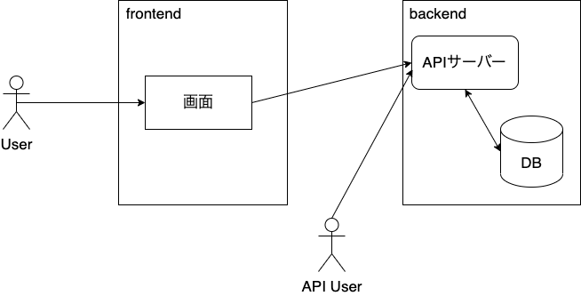
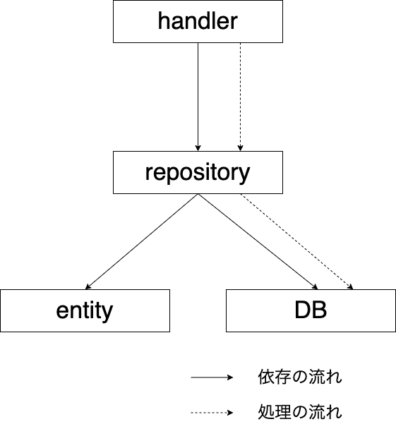

<style>
    h2{
        position: absolute;
        left: 50px; top: 50px;
    }
</style>

# 仕事でバックエンド開発するときに考えていること

技育祭2022 勉強会

---
## 自己紹介

- 名前: 鈴木 進也
    - yanyanと呼ばれています
- 株式会社CARTA HOLDINGS fluct アドプラットフォーム事業本部 開発本部所属
    - GoでGraphQLサーバーを書いたり、データエンジニアリングをしています
- 趣味
    - valorant
    - FF14 (最近始めました)
    - キーボードで散財

--- 

# 今日話すこと

---

## ざっくりとしたWebアプリケーションの構成



---

## ざっくりとしたWebアプリケーションの構成


この部分を作るときに考えていることを話します

---

## お題目

他にも考えることは色々あるが、今回は以下のことについて考える

- バックエンドアプリケーションのアーキテクチャの話
- API設計について
- テストの話
- 思想を言語化する

---

# アーキテクチャの話

---

## ここでいうアーキテクチャとは

- アプリケーションの実装をレイヤーごとに分けて整理する
- レイヤーに分けることによって以下のことが達成できる
    - 関心事の分離
    - 依存関係の整理


--- 

## よく目にするアーキテクチャたち

- レイヤードアーキテクチャ
- ヘキサゴナルアーキテクチャ
- オニオンアーキテクチャ
- クリーンアーキテクチャ
- etc...

--- 

# 彼らは銀の弾丸ではない

いかなるアプリケーションでも、このアーキテクチャを適用しとけばよいというわけではない

---

## 必要なときに増築する

- 良いアーキテクチャは、開発が進むにつれて変わっていくもの
- アプリケーションの規模が小さい段階から、壮大なアーキテクチャにしようとすると色々めんどくさい
    - ほとんどなにもしてないレイヤーが生まれる
    - 意味のない抽象化
    - なぜそのレイヤーが存在しているのかわからない = 認知負荷が高い
- 大事な考え方を守りつつ、必要に応じて層を足したり抽象化をすればよい

---

## 例えば

- 単に来たリクエストに応じてCRUDするだけならこれくらい素朴でもいい
- 開発したいことに応じてアーキテクチャも変化させていく



---

## 扱う関心事が増えた

- ビジネスロジックを書く層がほしい！
    - あとから足せば良い


---

## 抽象化したい

- repositoryに依存する層のユニットテストをしたい！
    - repositoryの部分はフェイクに差し替えたい 
- インターフェースに依存する形にする
    - 具象が１個だけなら抽象化する必要もない


---

## 大事な考え

私がアーキテクチャの構造を考えるときに守りたいこと

1. 関心事の分離
2. 依存の流れを1方向にする

これらを守りながら、その時々でベストな設計を模索する

--- 

## 関心事の分離

- 関心事とは
    - 働きかける対象
    - e.g.) DBとのやりとり、HTTP req/resについてetc...

---

## 関心事の分離

- まずは存在する関心事を言語化することが大事
- 1レイヤーが複数の関心事を扱わないようにする
    - e.g.) ファットコントローラー

```go
func BanbutsuHandler(w http.ResponseWriter, r *http.Request) {
    // http requestのあれこれ

    // ビジネスロジック

    // DBとのやりとり

    // http responseのあれこれ
}
```
---

## 各層が１つの関心事しか扱わないとどう嬉しい？

- 認知負荷が低い
    - 触りたい実装がどこにあるかが把握しやすい
    - e.g.) DB周りはrepository層をみればおｋ
- 変更しやすい
    - 変更するためにいじらなければならない箇所が明確になる
- 壊れたときに直しやすい
    - 壊れた原因が特定しやすい

---

## 依存関係

- レイヤー構造を成すので、レイヤー間に依存関係が生まれる
- 依存とは
    - 依存される側の知識が依存する側に漏れ出ている状態
    - メソッドの呼び出しに必要な引数とか
- 依存される側に変更が入ると、する側も影響を受ける
    - あるモジュールが依存したりされたりしまくっている (密結合) と辛い

---

## 依存の流れを1方向にする

- 依存の流れを交通整理する
- 具体的な関心事をもつレイヤー -> 抽象的な関心事を持つレイヤーという依存の流れを守る

---

memo: 円環構造の図を載せる
- 

---

## まとめ

- アプリの規模に応じて、その時々で適切な構造にしよう
- アーキテクチャもサービスの進化によって変化していくもの
- 変化の中でも常に守りたいことはなにかを考えよう

---

# API設計について

---

## APIスタイル

API設計の際に選択肢として出てくるモデルたち

- REST
    - リソースベースのURI
    - JSON形式でデータをやりとりする
    - 長いこと使われてきてる
- gRPC
    - [Protobuf](https://developers.google.com/protocol-buffers)形式でデータをやりとりする
    - マイクロサービス間の通信とかで使われている
- [GraphQL](https://graphql.org/)
    - クエリ言語＋クエリに対するサーバーサイド実装
    - 最近使われ始めている

---

## 大前提

- ユースケースに応じて使い分けよう
    - 銀の弾丸などない
- GraphQLはRESTの上位互換であるとか、そんなことはない
    - RESTを使ったほうがいい場合もある

---

## どういう軸で考えるのか

- APIの利用者
    - 誰が使うんだっけ
    - どのくらい使われるんだっけ
- ユースケースの数
    - 多様な利用者がいてユースケースも様々なんだよねーとか
- サービス的になにを重要視するか
    - APIとしての柔軟性？
    - パフォーマンス？ etc...

---

## ざっくりとした私の所感

- REST
    - リソースベースでエンドポイントを記述するので、1つのAPIでいろんなユースケースに対応しようとすると辛くなりがち
    - 1APIのユースケースが単純ならわかりやすい
- GraphQL
    - クエリによって利用者側が柔軟に欲しいデータを記述できるのでユースケースが多様な場合にいい
    - クエリの形式と返ってくるデータの形式がほぼ一緒なので直感的
- gRPC
    - パフォーマンス重視ならこれかなー

---

## 余談: 仕事でGraphQLを使っています

- 顧客向けWebアプリケーションの開発でGraphQLを採用した
- バックエンドの実装はGoで[gqlgen](gqlgen.com)というライブラリを利用している
    - スキーマ定義からリゾルバーのメソッドやモデルの構造体を生成してくれる
    - ブラウザ上でGraphQLのクエリが叩けるプレイグラウンド環境の用意もいいかんじにしてくれる
- スキーマの設計をいいかんじにするのがむずい

---

## 良いAPIとは？

*正しい使い方をするのが簡単で、間違った使い方をするのが難しい*

- APIを使う側のことを考えて設計する
- 適切にドキュメンテーションをする
- 命名の一貫性
- レスポンスの設計

---

## 例えば

APIスタイルによって気をつけたいことも変わってくる

REST, gRPCなら...
- エンドポイントのURIはわかりやすくなっているか
- クエリパラメータやリクエストボディの設計etc...

GraphQLなら...
- スキーマ設計
    - 命名の一貫性やわかりやすさ
    - nullが妥当に使えているか
- [Production Ready GraphQL](https://book.productionreadygraphql.com/)という本がおすすめ

---

# テストの話

---

## バックエンドにおけるテストは色々ある

- ユニットテスト
    - モジュール単体のテスト
- インテグレーションテスト
    - 複数のモジュールを跨いだテスト
    - repository - DB間のテストのような、アプリケーションの外側とのテストも含む

---

# Q.どのテストを書く？

---

# A.全部書けばええやん

---

# ~~A.全部書けばええやん~~

---

## なぜテストを書きたい?

- リリース前にバグに気づく
- 変更することに対する安全性、容易性
- テスト対象のコードの理解を助ける
- etc...

つまり、開発における様々な不安を取り除く

---

## どこにテストを書きたい？

テストを書くことによって不安を取り除きたい箇所

---

## どこにテストを書きたい

テストを書くことによって不安を取り除きたい箇所

- リリース後に壊れるとサービス的に致命的な箇所
    - お金が絡んだりして、後から直すのが辛いとか
- サービス的に大事なロジックが書かれている
    - ビジネスロジックとか
---

## テストを書かないという選択

特段不安がないとか、テストのコスパ悪そうだな〜って思った箇所には私はテストを書かない

- テストコードにもメンテナンスコストはかかる
- 自動テストにかかる時間が長くなると人々はテストしなくなる

-> テストしたいところだけテストする

---

## 例

こういうレイヤー構造で以下のことを考えてみる

- なんのテストを書きたいか
- なんのテストは書かないか

各レイヤーの関心事

- handler: HTTP req/res
- usecase: ビジネスロジック
- repository: DBとのやりとり
- entity: ビジネスオブジェクト 


---

## なんのテストを書きたいか

**あくまで例で、サービスの特徴によって変わる**

単純な構造なので書きたいテストはそんなに多くない

- usecase層のユニットテスト
- (ロジックがあれば) entity層のユニットテスト
- handler ~ repository まで一気通貫のインテグレーションテスト


---

## なんのテストを書かないか

**あくまで例で、サービスの特(ry**

- handlerのユニットテスト
- repositoryのユニットテスト
- repository - DB 間のインテグレーションテスト


---

## handlerのユニットテスト

HTTP request/responseが関心事

- それ以外の殆どの処理は他の層に委譲している
- つまり、ほとんどロジックがない薄い層 -> テストしたいことがない

この層にテストしたくなるようなロジックがいたら、関心事の分離がうまくできていないかもしれない

---

## repositoryのユニットテスト

- DBとやりとりすることが仕事なので、それ単体でテストしたいことは基本ない
- 複雑なSQLをクエリビルダーで組み立ててるとかならテストしたいかも

---

## repository - DB間のインテグレーションテスト

dockerとか使えば本番同様の環境がローカルやCI上で再現できるので、やればできる

- 基本的なCRUD処理程度ならテストしたいことない
    - MySQLやPostgresのテストがしたいのか？みたいになる
- トランザクション処理とかがちゃんとできるんだっけとかは、サービスによってはテストしたい

---

## テストは意図が大事

- なぜテストを書き、何をテストしたいのか
- 意図がわからないテストは、後々辛い
    - プロダクションコードの変更でテストがコケたとき、直しづらい
    - そのテストがなぜ存在しているのかわからないとメンテもされない

**本当にテストしたいところにテストを書こう**

---

# 思想を言語化しよう

---